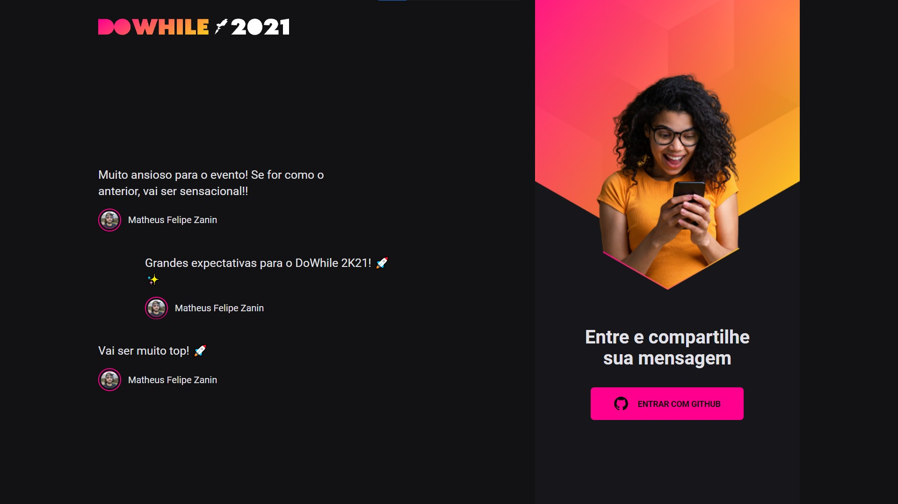

<div align="center">
  <h1>
    Web — NLW Heat 🔥
  </h1>

  

  > Página web da aplicação do mural de comentários do DoWhile 2K21, construída no evento **Next Level Week Heat** da Rocketseat.
</div>

## 💡 Você vai precisar

- Primeiramente de uma xícara de ☕ bem quentinho;
- [Node JS](https://nodejs.org/) instalado em sua máquina;
- Um [OAuth App](https://github.com/settings/developers) configurado no Github;

## 🎉 Começando

Clone o repositório:

```bash
git clone https://github.com/MattZ6/nlw-heat-web
```

Adentre a pasta do projeto:

```bash
cd nlw-heat-web
```

Instale as dependências:

```bash
yarn
```

## ⚙ Configurando

Com o **OAuth App criado em sua conta no Github**, você deve gerar um arquivo `.env` na raiz do projeto e preencher os valores das variáveis.

Copiar o arquivo `.env.example` para um `.env`:

```bash
cp .env.example .env
```

Preencha os valores das variáveis:

```yml
VITE_API_URL            = # URL do back-end (por padrão http://localhost:3333)

VITE_GITHUB_CLIENT_ID   = # Client ID do seu OAuth App.
```

## 🔥 Executando

Para rodar a aplicação em ambiente de desenvolvimento, execute o comando:

```bash
yarn dev
```

## 🤝 Contribuição

Contribuições, issues e novas features são sempre bem-vindas! <br/>
Fique à vontade para explorar as [issues](https://github.com/MattZ6/nlw-heat-web/issues).

## 👨‍🎤 Autor

Eu mesmo, [Matheus](https://github.com/MattZ6)! 👋
<br />
Quer conversar? [Chama aqui](https://www.linkedin.com/in/mattz6)!

## 📜 Licença

[Licença MIT](https://github.com/MattZ6/nlw-heat-web/blob/main/LICENSE.md) © 2021 [Matheus Felipe Zanin](https://github.com/MattZ6)

___

<div align="center">
  <strong>NLW Heat 🔥</strong>
</div>
